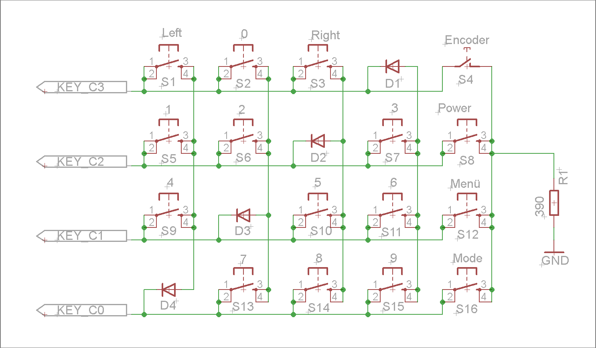

# KeypadMatrix

With this library you can add a special keypad matrix with up to 9 or 16 keys, which requires only 3 or 4 microcontroller pins.

## Features

* Seperates between short and long key press.
* Configurable long key press time.
* Supports 4 x 4 matrix (16 keys) or 3 x 3 matrix (9 keys).
* KEY_C0 - KEY_C3 must connected to mikrocontroller.
* S4, S8, S12 and S16 (see schematic below) can wake up the controller via interupt if required.
* Only single key press events are supportet.

*Schematic for 4 x 4 Matrix*

* D1 - D4 are simple diods like 1N4148

* R1 can be short-circuited. In the schematic above, R1 acts as short-circuit protection.